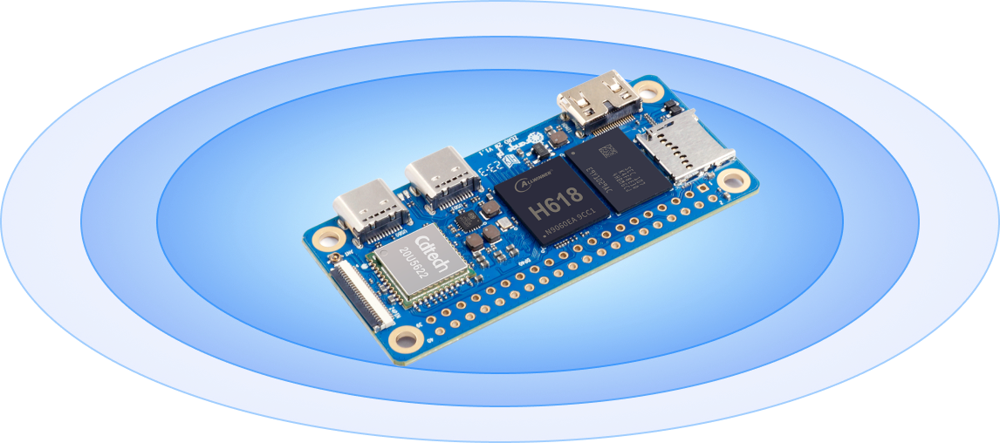

# Orange Pi used as Server for Telegram, Discord, and Twitch Bots

Tested on Orange Pi Zero 2W 2GB RAM.

<p align="center">
    
</p>

<p align="center">
    
</p>

# Initial Setup

1. Download the OS iso (I used the Raspberry Pi OS opizero2w Desktop version from [GitHub](https://github.com/leeboby/raspberry-pi-os-images));
2. Prepare a microSD card with the OS image (using [Balena Etcher](https://etcher.balena.io/)) and insert it into the board;
3. Connect the board to a monitor, keyboard, and mouse and power it up;
4. Go through the initial setup.

# Fix the disk space

```bash
df -h
```

If the disk space is not correct (you have a 32GB cards but it only shows 8GB), you need to expand the filesystem:

```bash
sudo raspi-config
```

Then go to **Advanced** -> **Expand Filesystem**

Reboot the system:

```bash
sudo reboot
```

Check the disk space again:

```bash
df -h
```

# Script to run all bots at the startup

The idea is that it will scan a specific folder (recursively) and run each `bot.py` file in a separate thread.

Save the file as `run_bots.py` in the `/home/orangepi/` folder.

```python
import os
import subprocess
import threading

BOTS_DIR = "/home/orangepi/bots"  # Adjust this path to where your bots folder is located

def run_bot(bot_path):
    """
    Function to run a bot file using subprocess
    """
    try:
        print(f"Running bot: {bot_path}")
        subprocess.run(['python3', bot_path], check=True)
    except subprocess.CalledProcessError as e:
        print(f"Error running {bot_path}: {e}")

def scan_and_run_bots():
    """
    Function to scan the bots folder and run each bot.py file
    """
    for root, dirs, files in os.walk(BOTS_DIR):
        for file in files:
            if file == "bot.py":
                bot_path = os.path.join(root, file)
                bot_thread = threading.Thread(target=run_bot, args=(bot_path,))
                bot_thread.start()

if __name__ == "__main__":
    scan_and_run_bots()

```

# Service to run the script at the startup

```bash
sudo nano /etc/systemd/system/run-bots.service
```

We wait for an additional 25 seconds before running the script to ensure that the network is up and running.

Write and save this to the file (edit the various paths and usernames as needed):

```bash
[Unit]
Description=Run Python bots at startup
After=network-online.target
Wants=network-online.target

[Service]
ExecStartPre=/bin/sleep 25
ExecStart=/usr/bin/python /home/orangepi/run_bots.py
WorkingDirectory=/home/orangepi/
User=username
Group=username
Restart=on-failure
RestartSec=30
StartLimitIntervalSec=0

[Install]
WantedBy=multi-user.target

```

Enable the service:

```bash
sudo systemctl daemon-reload
sudo systemctl enable run-bots.service
sudo systemctl start run-bots.service
```

Check the status for any error:

```bash
sudo systemctl status run-bots.service
```

# Headless

Depending on your setup, the board may not work properly without a monitor connected. I'm not sure on how this works (I just found this online and it fixed the problem for me), but it seems to fix the problem:

```bash
sudo nano /boot/config.txt
```

Add the following lines (the file may be empty, so just add these lines):

```bash
# Force HDMI even if no monitor is connected
hdmi_force_hotplug=1

# Set HDMI mode (optional but recommended for headless setups)
hdmi_group=1
hdmi_mode=1

# Reduce resolution for headless mode if desired (optional)
# You can set a lower resolution to reduce the load:
hdmi_mode=16  # 1024x768 resolution
```

# Add bots

Just put your bots in the `/home/orangepi/bots` folder and they will be run at the startup.

Remember that the files must be named `bot.py`, and they can be in subfolders.

Paths inside the code of any bot should be "total" and not "relative".
# Run

Just attach the board to the power and it will run the bots automatically.
